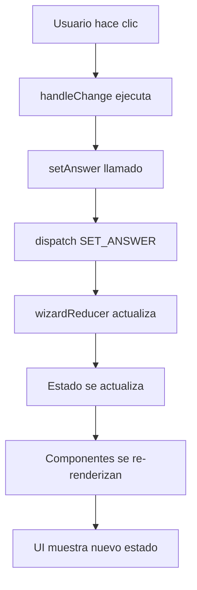

# 🧠 Gestión de Estado del Wizard - Guía Didáctica

> **Explicación sencilla y visual de cómo el wizard mantiene las preferencias del usuario**

## 🏠 **Analogía: El Wizard como una Casa con Habitaciones**

Imagínate que el wizard es una **casa de 8 habitaciones** (los 8 pasos). El usuario va de habitación en habitación llenando un **formulario gigante**, pero puede moverse libremente sin perder lo que ya escribió.

### 🗂️ **La "Carpeta Mágica" (WizardContext)**

Hay una **carpeta mágica** que sigue al usuario por toda la casa. En esta carpeta guarda todas sus respuestas:

```javascript
📁 Carpeta del Usuario (answers)
├── sleepSituation: "pareja" 
├── sleepPosition: ["lado", "espalda"]
├── firmness: 6
├── healthConcerns: ["dolor_espalda"]
├── materialPreference: null (aún no respondido)
├── budget: null (aún no respondido)
└── ...
```

## 🚪 **Recorrido Paso a Paso**

### **Habitación 1: Bienvenida** 
```
👋 "¡Hola! Vamos a encontrar tu colchón ideal"
📁 Carpeta: { (vacía) }
```

### **Habitación 2: ¿Cómo duermes?**
```
🛏️ Usuario elige: "Duermo en pareja"
📁 Carpeta: { sleepSituation: "pareja" } ✅ GUARDADO
```

### **Habitación 3: ¿En qué posición?**
```
😴 Usuario elige: "De lado" y "Boca arriba"  
📁 Carpeta: { 
  sleepSituation: "pareja", 
  sleepPosition: ["lado", "espalda"] ✅ GUARDADO
}
```

### **Habitación 4: ¿Qué firmeza?**
```
🎚️ Usuario elige: Firmeza 6
📁 Carpeta: { 
  sleepSituation: "pareja", 
  sleepPosition: ["lado", "espalda"],
  firmness: 6 ✅ GUARDADO
}
```

## 🔄 **¿Qué pasa si el usuario REGRESA?**

### **Usuario vuelve a Habitación 3**
```
😴 Al entrar ve: "De lado" ✅ y "Boca arriba" ✅ (ya marcados)
🤔 Decide cambiar: Solo quiere "De lado"

📁 Carpeta SE ACTUALIZA: { 
  sleepSituation: "pareja", 
  sleepPosition: ["lado"], 👈 CAMBIÓ
  firmness: 6 👈 SE MANTIENE
}
```

## 💾 **¿Cómo Funciona el Guardado Automático?**

### **Cada clic = Guardado instantáneo**
```jsx
// Cuando el usuario hace clic en una opción:
Usuario hace clic en "Duermo solo"
     ⬇️
handleSituationChange("solo")
     ⬇️  
setAnswer('sleepSituation', 'solo')
     ⬇️
📁 Carpeta actualizada instantáneamente
```

### **Es como WhatsApp** 💬
- Escribes un mensaje → Se guarda automáticamente
- Cambias de chat → Tus mensajes siguen ahí
- Vuelves al chat anterior → Todo está como lo dejaste

## 🧠 **El "Cerebro" del Sistema (useReducer)**

Imagínate que hay un **secretario súper eficiente** que:

1. **Escucha** cada acción del usuario
2. **Actualiza** la carpeta de respuestas  
3. **Nunca olvida** nada
4. **Avisa** a todas las habitaciones cuando algo cambia

```jsx
// El secretario recibe órdenes como:
"Guarda que el usuario duerme en pareja"
"Guarda que prefiere firmeza 6"  
"Cambia la posición a solo 'de lado'"

// Y actualiza la carpeta inmediatamente
```

## 👀 **Visualización del Estado**

### **Estado del Wizard (la carpeta mágica):**
```javascript
{
  currentStep: "firmness",           // 📍 Habitación actual
  answers: {                        // 📝 Respuestas del usuario
    sleepSituation: "pareja",       // ✅ Ya respondido
    sleepPosition: ["lado"],        // ✅ Ya respondido  
    firmness: 6,                    // ✅ Ya respondido
    healthConcerns: [],             // ⏳ Pendiente
    materialPreference: null,       // ⏳ Pendiente
    budget: null                    // ⏳ Pendiente
  },
  stepHistory: ["welcome", "sleep-situation", "sleep-position", "firmness"]
}
```

## 🔧 **¿Cómo se Conectan las Habitaciones?**

### **Cada habitación puede:**
- 👀 **Leer** la carpeta: `const { answers } = useWizard()`
- ✏️ **Escribir** en la carpeta: `setAnswer('firmness', 7)`
- 🚪 **Moverse** a otra habitación: `goToStep('budget')`

### **Ejemplo Real:**
```jsx
// En cualquier habitación (componente):
const { answers, setAnswer } = useWizard();

// Leer lo que ya guardó:
if (answers.sleepSituation === 'pareja') {
  console.log('El usuario duerme en pareja');
}

// Guardar algo nuevo:
setAnswer('firmness', 8); // Se guarda automáticamente
```

## 🎯 **Analogía del Supermercado**

### **Imagínate comprando en el supermercado:**

1. **Carrito de compras** = `answers` (respuestas del usuario)
2. **Pasillo de frutas** = Paso 1 → Agregas manzanas al carrito
3. **Pasillo de carnes** = Paso 2 → Agregas pollo al carrito  
4. **Vuelves a frutas** → Las manzanas siguen en tu carrito ✅
5. **Cambias las manzanas por peras** → Se actualiza automáticamente
6. **Vas a pagar** → Tienes todo lo que elegiste

### **El carrito NUNCA se vacía** hasta que termines la compra! 🛒

## 🎪 **Demo en Código Real**

```jsx
// Usuario en Paso 2: Situación de sueño
<button onClick={() => setAnswer('sleepSituation', 'solo')}>
  Duermo solo
</button>
// 📝 Se guarda: { sleepSituation: 'solo' }

// Usuario va a Paso 3: Posición
<button onClick={() => setAnswer('sleepPosition', ['lado'])}>
  De lado  
</button>
// 📝 Se guarda: { sleepSituation: 'solo', sleepPosition: ['lado'] }

// Usuario VUELVE a Paso 2:
{answers.sleepSituation === 'solo' && <span>✅ Ya seleccionado</span>}
// 👀 Lee del estado y muestra que ya eligió "solo"
```

## 🏗️ **Arquitectura Técnica Simplificada**

### **1. React Context + useReducer**
```jsx
// WizardContext.jsx - El "cerebro central"
const [state, dispatch] = useReducer(wizardReducer, initialState);
```

### **2. Estado Inicial**
```jsx
const initialState = {
  currentStep: STEPS.WELCOME,     // Dónde está ahora
  answers: {                      // 🔑 TODAS las respuestas
    sleepSituation: null,
    sleepPosition: [],
    firmness: null,
    // ... más respuestas
  },
  stepHistory: [STEPS.WELCOME]    // Por dónde ha pasado
};
```

### **3. Tipos de Selección**

#### **Selección Simple (Radio Button)**
```jsx
// Solo UNA opción - Ej: "Duermo solo" o "Duermo en pareja"
const handleSituationChange = (situation) => {
  setAnswer('sleepSituation', situation);  // Reemplaza el valor
};
```

#### **Selección Múltiple (Checkboxes)**
```jsx
// MÚLTIPLES opciones - Ej: Posiciones de sueño
const handlePositionToggle = (position) => {
  const currentPositions = answers.sleepPosition || [];
  const isSelected = currentPositions.includes(position);
  
  let newPositions;
  if (isSelected) {
    // Si ya está seleccionado, lo quita
    newPositions = currentPositions.filter(p => p !== position);
  } else {
    // Si no está, lo agrega
    newPositions = [...currentPositions, position];
  }
  
  setAnswer('sleepPosition', newPositions); // Actualiza array completo
};
```

#### **Selección con Escala (Firmeza 1-10)**
```jsx
// Valor numérico en rango
const handleFirmnessChange = (value) => {
  setAnswer('firmness', parseInt(value));
};
```

## 🔄 **Flujo de Actualización**



## ✅ **Ventajas del Sistema**

### **🚀 Persistencia Automática**
- Las respuestas se guardan **inmediatamente** al seleccionar
- No se pierden al navegar entre pantallas
- No necesita botón "Guardar" manual

### **🔒 Estado Inmutable**
- Usa spread operator `...state` para no mutar
- React detecta cambios correctamente
- Re-renderiza solo componentes afectados

### **🌍 Acceso Global**
- Cualquier componente puede leer `answers`
- Un solo lugar de verdad para el estado
- Consistencia en toda la aplicación

### **🧭 Navegación Inteligente**
- Puede ir hacia atrás sin perder datos
- Historial de pasos visitados
- Validación de pasos completados

## 🚨 **Casos Especiales**

### **¿Qué pasa si el usuario abandona y vuelve?**
```jsx
// Actualmente: Se pierde el estado (no hay persistencia en localStorage)
// Futuro: Se podría implementar persistencia local
```

### **¿Se puede deshacer una acción?**
```jsx
// Sí, simplemente cambiar la selección actualiza el estado
setAnswer('firmness', 5);  // Tenía 6, ahora 5
```

### **¿Se puede resetear todo?**
```jsx
// Sí, hay una acción para eso
resetWizard(); // Vuelve al estado inicial
```

## 📚 **Archivos Relacionados**

- `src/contexts/WizardContext.jsx` - Contexto y lógica principal
- `src/components/wizard/WizardContainer.jsx` - Contenedor principal
- `src/components/steps/*.jsx` - Cada paso del wizard
- `wizard.css` - Estilos para feedback visual

## ✨ **Resumen en 3 Frases**

1. **Cada clic se guarda automáticamente** en una "carpeta mágica" 📁
2. **La carpeta sigue al usuario** por todas las pantallas 🚶‍♂️  
3. **Nunca se pierde nada** hasta que termine el wizard 🎯

¡Es como tener una **memoria perfecta** que nunca olvida lo que elegiste! 🧠✨

---

> **💡 Tip para desarrolladores:** Si necesitas agregar un nuevo tipo de pregunta, solo tienes que:
> 1. Agregar la clave en `initialState.answers`
> 2. Crear el componente Step correspondiente
> 3. Usar `setAnswer(key, value)` para guardar la respuesta
> 4. ¡Listo! El sistema se encarga del resto 🚀